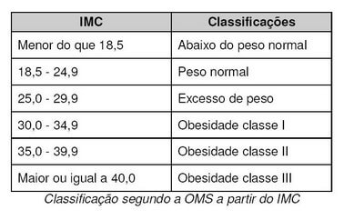
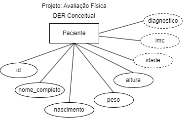
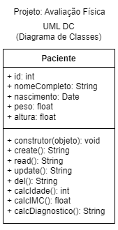
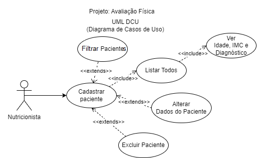
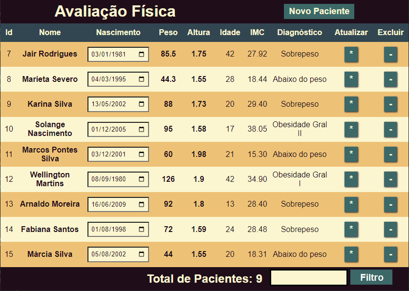
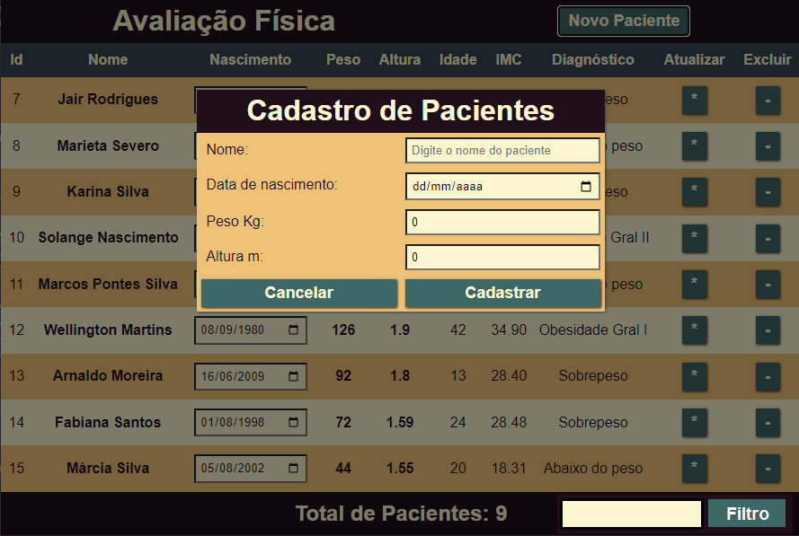
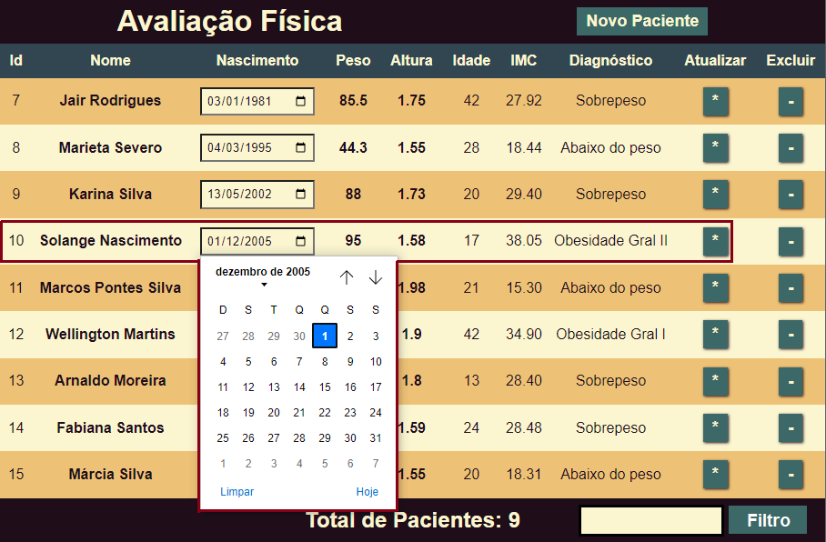
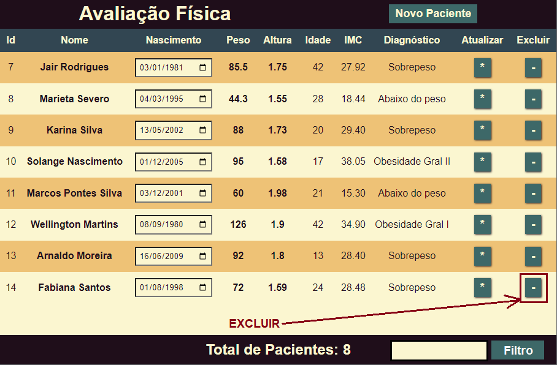

# Tema - Avaliação Física

## Contextualização:

A Sra. Carla Prestes é nutricionista e precisa de um sistema para cadastrar seus pacientes e que faça uma rápida anamnese (pré-diagnóstico)
- O Analista de sistemas já elencou as **Regras de negócio** e realizou a **análise de requisitos** documentando conforme diagramas a seguir:

|Documento|Diagrama|
|-|-|
|Regras de negócio|[RN001] Manter um cadastro de pacientes com nome, nascimento, peso, altura, imc e pré diagnóstico [RN002]Calcular o IMC e pré diagnóstico conforme tabela [RN003]Permitir alteração de dados[RN004]Permitir exclusão de dados |
|DER Modelo Conceitual||
|UML - DC||
|UML - DCU||

## Desafios

|Back-end:|
|-|
|Missão: desenvolver um banco relacional e uma REST API com funcionalidades CRUD conforme descrito nos diagramas, utilize os dados abaixo para semear e testar sua aplicação, recomendo o aplicativo insomnia para testar|

|Nome|Nascimento|Peso|Altura|
|-|-|-|-|
|Jair Rodrigues|1981-01-03|85.5|1.75|
|Marieta Severo|1995-03-04|44.3|1.55|
|Karina Silva|2002-05-13|88|1,73|
|Solange Nascimento|2005-12-01|95|1.58|
|Marcos Pontes|2001-12-03|60|1.98|

|Observações:|
|-|
|Dados calculados nem sempre precisam ser armazenados em bancos de dados: - Podem ser calculados através de **visões**(Views) no SGBD e apenas exibidos os resultados, - Podem ser calculados na API back-end através de métodos/funções: &emsp;- Podem ser calculados quando os dados são listados um a um &emsp;- Podem ser calculados quando os dados são todos de uma vez &emsp;- Podem ser calculados quando os dados são cadastrados e armazenados no banco de dados - Para cada problema devemos avaliar qual a melhor alternativa quanto a processamento e armazenamento **- Neste caso o Analista decidiu que os resultados dos cálculos não devem ser armazenados então calcule nos métodos da API ou em forma de VIEW no BD**|

|Front-end:|
|-|
|Missão: Desenvolver uma UI(User Interface) conforme requisitos funcionais e wireframes a seguir:|

|Descrição|Tela|
|-|-|
|[RF001]Tela CRUD **Criticidade**: (x)essencial ( )importante ( )desejavel  [RF001.1] cadastrar apenas localmente (localStorage) os dados de pacientes para testar, **Criticidade**: ( )essencial (x)importante ( )desejavel  [RF001.2] se desejar crie um JSON com os dados de pacientes pré-cadastrados **Criticidade**: ( )essencial ( )importante (x)desejavel||
||[RF002]Modal de cadastro de pacientes **Criticidade**: (x)essencial ( )importante ( )desejavel|
|[RF003]Alteração via linhas editávejs da tabela, ou se preferir abrindo um modal preenchido com os dados para alteração **Criticidade**: ( )essencial (x)importante ( )desejavel||
||[RF004]Funcionalidade de remover pacientes, peça uma confirmação para evitar exclusões acidentais **Criticidade**: ( )essencial ( )importante (x)desejavel|

|Mobile:|
|-|
|Missão: Desenvolver uma UI(User Interface) para celular conforme requisitos funcionais e wireframes acima mantendo os dados armazenados localmente no celular|

|Full Stack:|
|-|
|Missão: Desenvolver um sistema integrado com banco de dados relacional, API e UI(User Interface) requisitos funcionais e wireframes acima, se preferir pode utilizar banco não relacional como Firebase/firestore ao invés de API porém atente-se a segurança das chaves de API|

|Engenharia de software:|
|-|
|Missão: Desenvolva um UML DA(Diagrama de atividades) para servir de manual para o usuário dos processos de cadastro, alteração e exclusão de pacientes|
